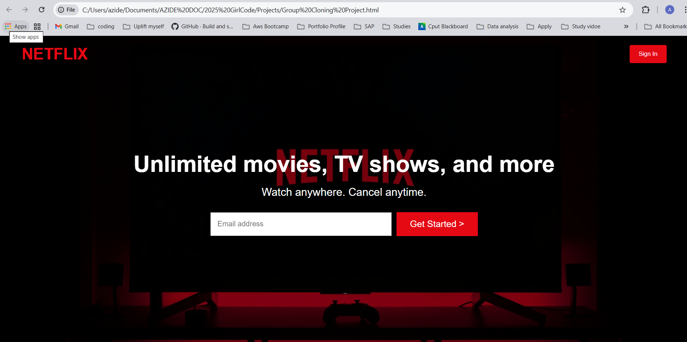
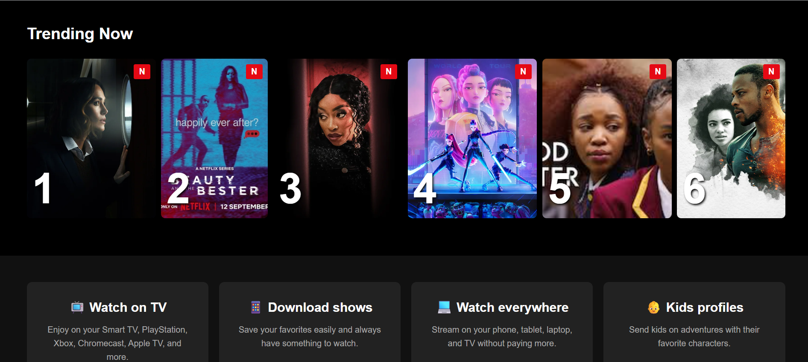

# 🎬 Netflix Clone Group Project  

A responsive **Netflix landing page clone** built using **HTML and CSS**.  
This group project was created to practice front-end design, layout styling, and responsive web development inspired by the Netflix homepage.  

---

## 🖼️ Project Preview  

  

> *A modern recreation of the Netflix landing page, built entirely with HTML & CSS.*

---

## 🚀 Features  

✅ **Hero Section** — Eye-catching banner with headline, subtext, and email input  
✅ **Trending Section** — Scrollable list of trending shows with Netflix badge and ranking  
✅ **Feature Cards** — Highlights Netflix’s services (Watch Anywhere, Kids Profiles, etc.)  
✅ **FAQ Section** — Interactive dropdowns using HTML `
` and `
`  
✅ **Responsive Layout** — Mobile-friendly grid and flexbox design  
✅ **Clean, Netflix-inspired Design** — Bold colors, clean typography, and familiar UI  

---

### 🎥 Hero Section

### 🔥 Trending Section

---
## 🧑‍💻 Technologies Used  

- **HTML5** : Page structure and semantic content  
- **CSS** : Styling, layout, and responsive design  
- **Unsplash & Netflix Assets** : For realistic placeholder visuals  

---

## 📂 Project Structure  

